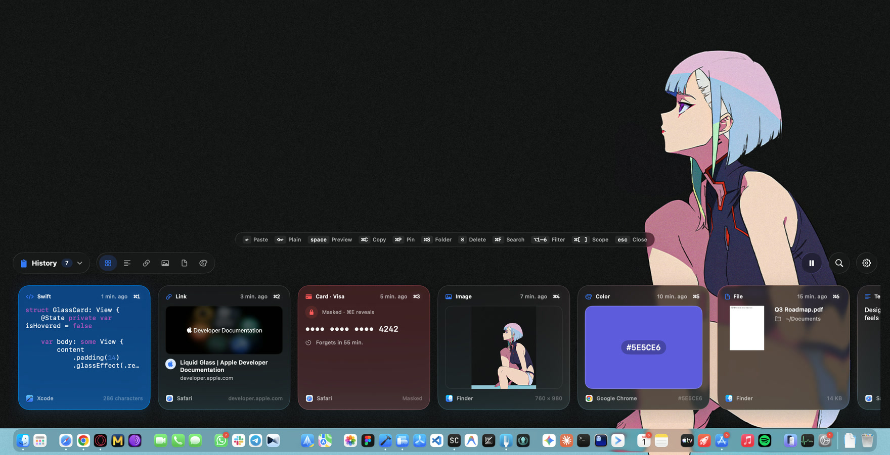
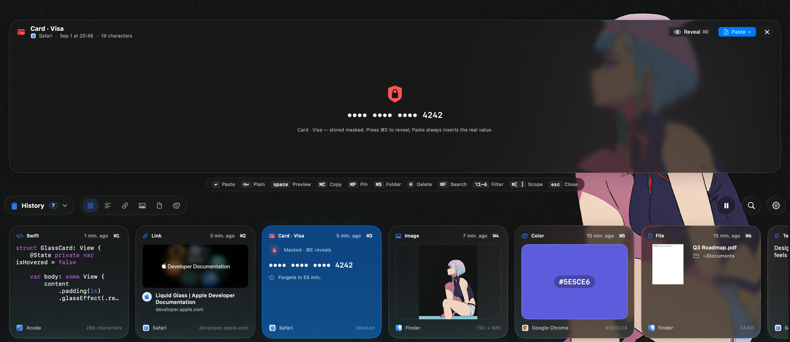
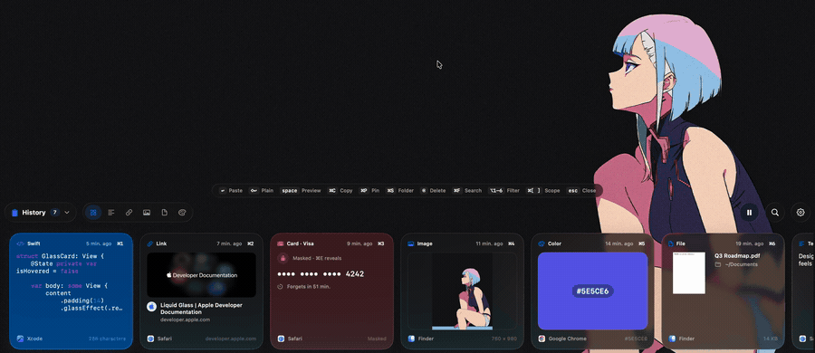
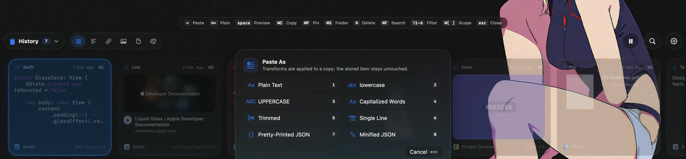

<div align="center">

# Mahmut Clipboard

**Everything you copy, one keystroke away.**

Press ⌘⇧V and a glass panel slides up from the bottom of the screen with everything you've copied. Arrow to it, hit Return, and it's pasted back into the app you were already in.

[](https://apps.apple.com/us/app/clipboard-mahmut/id6446905294)
&nbsp;


<br>



</div>

---

## What it does

Every clipboard manager keeps a list. The annoying part was never the list — it's that you have to go *look* at it. Open a window, find the thing, copy it, come back, paste it, and by then you've forgotten what you were writing.

Mahmut doesn't take focus. The panel is a non-activating window, so the app you were working in never stops being frontmost. You press ⌘⇧V mid-sentence, arrow to the snippet, hit Return, and the text appears where your cursor already was.

It also reads what you copied. Paste a Swift function and it comes back syntax-coloured with a `Swift` badge. Paste a URL and it grows a page title, hero image and favicon. Copy a screenshot and it's run through on-device text recognition, so a week later you can find it by typing a word that was *inside the picture*. Copy `#5E5CE6` and you get a swatch you can paste back as hex, `rgb()`, `hsl()`, SwiftUI `Color`, `NSColor` or `UIColor`.


## Why it's good

**Your card number never sits in a list in plaintext.** Payment cards are Luhn-checked, IBANs are validated mod-97, and ten token shapes — OpenAI, AWS, GitHub, Slack, Google, Stripe, JWTs, bearer tokens — are matched on sight, with PEM private keys and bare `password:` lines caught alongside them. What gets stored is the masked string; the real value is revealed only when you ask for it with ⌘E, and it's forgotten on its own timer, an hour after you copied it by default. Anything a password manager marks concealed or transient is never recorded at all.



**Pasting from Mahmut doesn't create a duplicate of itself.** Every paste writes a private pasteboard type carrying that item's UUID. When the monitor sees its own marker come back it bumps the existing row's timestamp instead of filing a copy — which is the difference between a history and a hall of mirrors.

**Space, and the thing gets bigger.** Quick Look renders full text with colouring, images at size with the text Vision found in them, link cards, every format of a colour, and a real `QLPreviewView` for PDFs and documents. The panel grows upward from its anchored bottom edge; nothing else on screen moves.



**Drag a card straight out of the panel.** Into Finder, into Mail, into a Slack message. Files are dragged by reference and you choose in Settings whether the drop copies or moves the original. Images arrive as a file promise named `Clipboard Image 2026-09-01 at 20.41.03.png`, and chat apps that want pixels get pixels instead.

**Paste it in a shape you didn't copy it in.** ⌘T offers the same text as plain, lowercase, UPPERCASE, Capitalized Words, trimmed, collapsed to a single line, or JSON pretty-printed or minified — eight options, each one a number key away. The transform applies to the copy that lands in your document; the stored item is left exactly as you copied it.



**It's built for people who don't reach for the mouse.** Type anything and it searches — including the words Vision found inside your screenshots. ⌘1–⌘9 paste the first nine cards outright. ⌥1–6 filter to text, links, images, files or colours. ⌘[ and ⌘] move between folders, ⌘S saves a keeper into one, ⌘P pins it so retention can never touch it. Every one of those is printed along the top of the panel, so there's nothing to memorise.


## FAQ

<details>
<summary><b>Is it actually free, or free-until-it-isn't?</b></summary>
<br>

Free. There is no StoreKit code left in this repository — no subscription, no unlock, no trial, no "Pro" tier. Earlier versions had all of that; 3.0 deleted it along with everything it gated.

</details>

<details>
<summary><b>The App Store says "Clipboard Mahmut", version 1.7.1. Is that this?</b></summary>
<br>

Yes. **Clipboard Mahmut** is the name on the store and it's staying that way; **Mahmut Clipboard** is what the app calls itself once it's running. Same app either way.

The version gap is real, though: 3.0 is a rewrite and it's in review right now. Until it lands the listing still serves 1.7.1, which looks nothing like the screenshots on this page and predates most of what it describes. If you want 3.0 today, build it from source.

</details>

<details>
<summary><b>Does anything I copy leave my Mac?</b></summary>
<br>

No. History lives in a Core Data store inside the app's sandbox container and is never uploaded. The app makes exactly two kinds of network request, both optional and both switchable off in Settings: fetching the page title for a copied link (the fetch stops at 200 KB), and asking the App Store whether there's a newer version. That's the whole list. The app is sandboxed, and the only other things its entitlements ask for are read-only access to files you explicitly chose and the bookmarks to find them again.

</details>

<details>
<summary><b>What happens when I copy a password?</b></summary>
<br>

Password managers flag their clipboard writes as concealed or transient, and Mahmut skips those entirely by default. For everything else — a card number pasted from a bank page, an API key out of a `.env`, a `password:` line in a config file — the sensitive detector catches it, stores it masked, and deletes it an hour later. You can shorten that to ten minutes, extend it to a day, or tell Mahmut not to record sensitive content at all.

</details>

<details>
<summary><b>Do I have to give it Accessibility access?</b></summary>
<br>

Only if you want the paste to happen by itself. Choosing an item always puts it on the clipboard; the extra step of simulating ⌘V in the app you were using is something macOS only permits with Accessibility access. Without it, everything works — you just press ⌘V yourself.

</details>

<details>
<summary><b>Will my history grow forever?</b></summary>
<br>

Not unless you ask it to. Out of the box it keeps the last 50 items and drops anything older than two days. You can go up to 500 or unlimited, and stretch the age limit to 30 days or never. Pinned items and anything saved into a folder are exempt from both rules — that's the point of pinning.

</details>

<details>
<summary><b>Is a clipboard manager going to sit there eating my battery?</b></summary>
<br>

macOS has no notification for "the clipboard changed", so every clipboard manager polls. Mahmut reads one integer — `NSPasteboard.changeCount` — every 350 ms, and only touches the actual contents when that integer moves.

</details>

<details>
<summary><b>⌘⇧V collides with something I use.</b></summary>
<br>

Change it. Settings has a shortcut recorder; the only rule is at least one of ⌘, ⌃ or ⌥ so the hotkey can't swallow ordinary typing. Worth knowing: the default overlaps "Paste and Match Style" in some apps.

</details>

<details>
<summary><b>Why is it called Mahmut?</b></summary>
<br>

It's been called that since 2023 and it's too late now.

</details>

## Under the hood

Swift 6, SwiftUI with Liquid Glass on macOS 26, and [The Composable Architecture](https://github.com/pointfreeco/swift-composable-architecture) — every side effect the app has (the pasteboard, the hotkey, the panel, Vision, the store) is a dependency the reducer talks to through a protocol witness.

The three decisions that were actually interesting:

- **The panel is an `NSPanel` that can become key without activating the app.** `.nonactivatingPanel` plus `canBecomeKey` true and `canBecomeMain` false — so search and arrow keys work while the app you were in stays frontmost and receives the simulated ⌘V directly. Getting this wrong is why some clipboard managers paste into themselves.
- **The list never loads a blob.** Fetches use `NSDictionaryResultType` with an explicit `propertiesToFetch`, so scrolling reads columns, not content. Images are normalised to PNG once and written beside a 640 px thumbnail that is the only thing the strip ever decodes. Caches are bounded on purpose — 64 MB and 500 images, 600 attributed strings — instead of growing until something else on the Mac suffers.
- **Drag needed AppKit.** SwiftUI's `onDrag` can't restrict the operation mask, and "copy or move, your choice" is exactly an operation mask. So each card has an `NSView` overlay owning hover, click, context menu and the drag session — and because that overlay never changes geometry, tracking areas stay stable while the strip animates.

Files are held as security-scoped bookmarks, so a file you copied last week still drags out correctly after a reboot, without Mahmut ever having copied the file itself.

It also tries to be usable if you aren't reading the screen. Each card is one VoiceOver element with a written description rather than a heap of fragments — a masked card says "Masked Visa card, ending 4 2 4 2" instead of reading out bullets, and an image speaks the text Vision found inside it. Every panel shortcut has a matching rotor action, so nothing depends on being able to hit ⌘⇧R. Reduce Transparency swaps the glass for a solid surface, Reduce Motion drops the springs, and Differentiate Without Color gives the selected card a border instead of a tint.

## Building

Needs macOS 26 and Xcode 26. Open `clipboardManager.xcodeproj`, trust the Swift Syntax macros when Xcode asks, and run.

```sh
xcodebuild -scheme clipboardManager -configuration Debug -skipMacroValidation build
```

Two DEBUG-only environment variables are handy while working on it: `MAHMUT_SHOW_PANEL=1` opens the panel a second after launch so you don't need the hotkey, and `MAHMUT_RENDER_MARKETING=1` renders the screenshots and GIFs in this README from the real views with sample data. See [`docs/media/README.md`](docs/media/README.md) for how those were made.

## Say hi

Found a language it highlights wrong, a secret it should have masked and didn't, or an app it refuses to paste into — [open an issue](https://github.com/orion-supernova/clipboardManager/issues) with what you copied and where it came from, or email **info@walhallaa.com**. Every message gets read.

[GPL-3.0](LICENSE). Fork it, ship it, sell it if you like — your version has to be open source too.

<div align="center">
<br>
<sub>Built by <a href="https://walhallaa.com">Murat Can Koç</a></sub>
</div>
